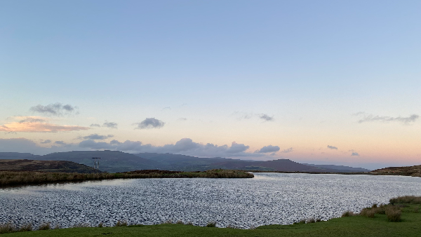
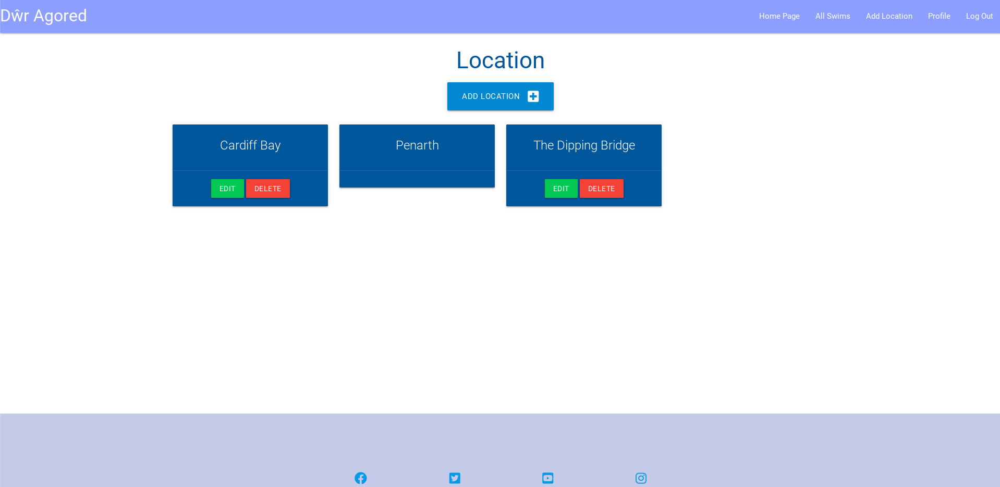
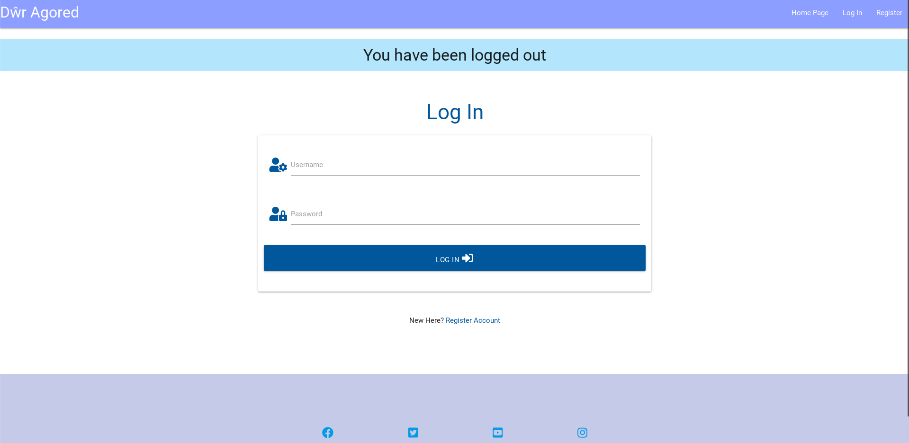

# Dŵr Agored

The purpose of Dŵr Agored is to offer cold water swimmers in the South Wales area a website to browse and post their experiences of cold water swimming. This website is useful to swimmers as they are able to recommend places they enjoy and warn other swimmers of potentially dangerous places. It can also be used as a diary for swimmers. Users can browse other people’s experiences to gain new cold water swimming destinations.

Here is the deployed version of [Dŵr Agored](https://dwragored-d6da67bc58d1.herokuapp.com/).

Please see my old repository for old commit messages, as it was necessary to create a new workspace when fixing this site:

[Old repository](https://github.com/mipear/dwr-agored)

## UX

## User Stories

## Target Audience

The target audience for this website are experienced or potential cold water swimmers within the South Wales area. By refining to a smaller location in this target, it is likely more users will create more posts within one location and posts are relevant to the user. By naming the website “Dŵr Agored”, this targets a Welsh audience by using the Welsh language.

#### First Time Visitor Goals

As a first time user of the site, I want to be able to

- Create an account
- Learn what the website is about
- Follow Dŵr Agored on social media

#### Returning Visitor Goals

As a returning user of the site I want to be able to:

- Log in to own account
- Post own experience of cold water swimming in South Wales area
- Edit and delete own posts
- Find cold water swimming locations in South Wales.

### User Journey

### All user goals

- Create an account
- View swimming locations on a map of South Wales
- Learn about what the website does

### Returning user goals

- Log in to own account
- Post own experience of cold water swimming in South Wales area
- View other people's post to gain new recommendations
- Edit and delete own post
- View own posts to reminisce and reflect on own experiences

### Future Development

- Map for users to be able to input their swim location. This would be their precise location as opposed to a trust based map.
- Ability for users to reset passwords if they have forgotten their password
- For users to be able to upload photos of their swimming experience
- Ability for users to comment on each other's posts

## Wireframes

### Home Page

The Home Page is a page all users have access to. The purpose of this page is to educate the users of the website's purpose.

### All Swim

Initially called "My Swim", "All Swim" features users' swim experiences through filling out the "My Swim" form.

### Log In

This will be the log in page.

## Features

### Favicon

The Favicon is a simple wave icon. Initially, this would be a more complex image of a person swimming, however, it was difficult to see and therefore caused a bad user experience. The wave allows any user to understand immediately the site's focus on water.

### The Navigation Menu

Burger navigation:

The NavBar for new users shows only three pages: Home Page, Register, and Log In. The Navigation Bar changes when users log in, allowing returning users to have access to the following: Home Page, All Swims, Location, Profile, Log Out. The necessity to have an account for the likes of “All Swims” and “Location” ensures that only regular users are able to create posts and edit other people’s. The profile offers a space for users to feel individually a part of the website. In future implementations of this site, users’ own swims will feature on their Profile page and users could follow other users. On smaller screens, this becomes a hamburger menu to ensure good user practice.

Burger Navigation for logged out users on tablet:

### Logo

The Logo is simply the title “Dŵr Agored” written in blue. This is situated on the left of the nav bar. When clicked, this will redirect to the Home Page. “Dŵr Agored” translates to “Open Water”. The simplicity of this definition and the styling of the logo has been done to emphasise the simplicity of the concept itself and the necessity of it too. The fact that this is written in Welsh, contextualises the site to be for people in Wales, immediately targeting the desired users.

### Home Page

The Home Page is a page all users have access to. The Home Page’s purpose is to clearly tell the new or returning user what the purpose of the website is. It shows a hero image and an About section. Initially, this was going to have the All Swims posts too, however, this has been changed to entice new users to register and become a recurring user. The more returning users that visit the site and create posts, the more locations and experiences that exist on the website, creating a space for recommendations and reflections. It’s important for users to feel the benefits of having an account and signing in.

Desktop:

Tablet:

Mobile:

### Hero Image

The hero image, situated on the Home Page, is an image of Pen-Ffordd-Goch in South Wales taken by myself before a swim. As this image is one of the initial things a user will see, the hero image contextualises the website by immediately highlighting the need for the site itself. This image is simply as the website suggests, “Dŵr Agored” - “Open Water”. It is hard to find good swimming locations in South Wales, this website aims to help users with this issue and this image highlights one location.

### Colour Palette

The colour palette was inspired by the hero image and the theme of water itself. The intention was to be as simple and clear as possible to ensure the user is able to understand and navigate the website with ease. The colours were chosen using Coolors to pick colours from the hero image and then compared to using Materialize to create a more cohesive finish.

### All Swims

The All Swims page only features for returning users. This page shows users’ posts. The All Swims page features an image of somebody swimming in cold water, immediately aligning the values of the website with the user. As the returning user is likely to either be a cold water swimmer themselves or tempted by the prospect, this image allows the user to recognise themselves in the image and with the site as a whole, making the space more personal.

Below the image are collapsible posts of users’ swims. The posts initially shows the title of the swim and the date of the swim. When a user clicks the arrow button on the left, the post is shown fully. Users are able to see the Location, a description, the cleanliness of the swim, and whether the user would like to go again.

Desktop:

Tablet:

Mobile:

### Edit and Delete

Users are able to edit their swim by clicking the “Edit” button on the collapsible swim posts on the All Swims page. By clicking “Edit”, users are taken to the swim form they initially filled out to add their swim, but are now able to adjust their answers. To delete a swim, users can click “Delete” on the same collapsible post. The “Delete” button, when clicked, takes the user to a modal asking whether the user is sure they wish to delete their swim. This defensive programming ensures users cannot accidentally delete their posts.

To ensure good user practice, users are only able to edit/delete their own posts, as seen below:

Above, users are able to edit the swim, due to them having created the post, whereas below they cannot.

### Add Swim Button

Situated on the All Swims page, above the image of somebody swimming, is the “Add Swim Button”. When clicked, this button takes the user to a form where users are asked to give a title to their swim, describe their swim, rate the cleanliness, choose a date of when they went swimming (this could be any time in the past as the user did not necessarily go swimming on the day of posting), are asked if they would go again, and asked to specify the location from the dropdown. While the title and description are boxes for the user to type into, the dat is selected using Materialize’s “Datepicker”, creating a good user experience. Once users are happy with their entry, the user will click “Add Swim” below the form to post their swim.

Add swim form:

Desktop:

Tablet:

Mobile:

### Location Page

The Location page is a space in which users can add their swim locations in order to use for the All Swims post. To add a location, users simply click “Add Location”. Users type their specified location before selecting “Add New Location”. This page is for regular users only in order to protect the locations submitted. If a location is deleted, all posts using that location are also deleted, as this website’s predominant focus is recommending locations. Once added, locations are presented using Materialize cards, featuring the name of the location and edit/delete buttons similar to the All Swim buttons. These locations make up the locations users are able to choose from within the My Swim form.

As seen below, only the location creator is given the option to edit and delete their location, ensuring other users cannot alter locations.

Desktop:

Tablet:

Mobile:

### Add location

Once sers have clicked the "Add Location" button, the user is taken to its form. Users will type the name of their desired location before clicking to add it.

Desktop:

Tablet:

Mobile:

### Footer

The footer is featured on every page, allowing users to navigate to their desired social media platforms, opening up in a new window to ensure good user experience.

### Log In/Log Out/Register

Users are able to Register for an account. Users must log in to access the All Swims and Location pages.

Register page:

Log in to access All Swims/Location:

Logged out Desktop:

Logged out tablet:

Logged out mobile:

### Profile

When users log in or register, they are taken to the profile page. Here users are welcomed and are able to add a swim.

Dektop:

Tablet:

Mobile:

## Functionality

“Dŵr Agored” has CRUD functionality. Regular users are able to Create posts, Read posts on the All Swims page, Update posts using the “Edit Swim” button, and Delete posts using the “Delete Modal”. Furthermore, regular users are able to Create, Read, Update, and Delete locations. Users are only able to use this CRUD functionality if they are logged in. To log in, users must first registrate using the “Registrate” page. Users are then asked to Create a username and a password. This has been created using cards through Materialize and the Taskmanager mini project on Code Institute. The authentication has been adapted to be compatible with SQL.

### Accessibility

Materialize has been incredibly useful in ensuring accessibility needs are met. All images featured also include descriptive alt tags to ensure good user practice. Semantic HTML has been used consistently to ensure code is clear and readable. Colours have been considered to ensure there is sufficient contrast so users can navigate the website with ease.

## Database Schema

## Testing

### User Stories

| **As a ... I want to...**                                                                        | **Action**                                                                                                                                                                                                                                                                                                                                                                                                                                                                                                                                                                                                                     | **Evidence**                                                                                                                                                                                                                                                                                  |
|--------------------------------------------------------------------------------------------------|--------------------------------------------------------------------------------------------------------------------------------------------------------------------------------------------------------------------------------------------------------------------------------------------------------------------------------------------------------------------------------------------------------------------------------------------------------------------------------------------------------------------------------------------------------------------------------------------------------------------------------|-----------------------------------------------------------------------------------------------------------------------------------------------------------------------------------------------------------------------------------------------------------------------------------------------|
| As a First Time user, I want to create an account                                                | By clicking “Register” on the Navigation Bar, first time users are able to create an account by typing in a unique username and a password.                                                                                                                                                                                                                                                                                                                                                                                                                                                                                    | [Register](https://github.com/mipear/dwragored/blob/main/dwragored/static/images/docs/testing/register.png)                                                                                                                                                                                   |
| As a First Time user, I want to learn what the website is about                                  | The homepage offers cold water swimmers a space to learn the purpose of the website. Immediately the website shows an image of open water, the logo itself translates to “Open Water”, and the About section explains the purpose of the website.                                                                                                                                                                                                                                                                                                                                                                              | [Homepage](https://github.com/mipear/dwragored/blob/main/dwragored/static/images/docs/testing/homeipad.png)                                                                                                                                                                                   |
| As a First Time user, I want to follow Dŵr Agored on social media                                | [Twitter](https://www.twitter.com), [Facebook](https://www.facebook.com), [Instagram](https://www.instagram.com), and [Youtube](https://www.youtube.com)                                                                                                                                                                                                                                                                                                                                                                                                                                                                       | [Socials](https://github.com/mipear/dwragored/blob/main/dwragored/static/images/docs/testing/socials.png)                                                                                                                                                                                     |
| As a Returning user, I want to log into my own account                                           | By clicking on “Log In” on the navigation menu, the user is redirected to the Log In page wherein users can type in their previously created username and password and click to log in. Users will be taken to their profile page.                                                                                                                                                                                                                                                                                                                                                                                             | [Log In](https://github.com/mipear/dwragored/blob/main/dwragored/static/images/docs/testing/logintoaccess.png)                                                                                                                                                                                |
| As a Returning user, I want to post my own experience of cold water swimming in South Wales area | The “All Swims” page features an “Add Swim” button. When clicked, users are taken to the Add Swim form wherein they are asked for the following: swim title, swim description, cleanliness, would they go again, date of swim, and location. After completing this form and clicking “Add Swim”, users are redirected back to the “All Swims” page where they will find their new post.                                                                                                                                                                                                                                        | [Add Swim](https://github.com/mipear/dwragored/blob/main/dwragored/static/images/docs/testing/addswimdesktop.png)                                                                                                                                                                             |
| As a Returning user, I want to edit and delete my own posts                                      | Users are able to edit and delete posts using the “Edit” and “Delete” buttons found on the collapsable posts on the “All Swims” page. When the “Edit” button is clicked, users are taken back to the swim form they’d previously filled, and are able to change their answers. When the “Delete” button is selected, users are shown a modal confirming that users are sure they would like to delete. This is to ensure that no swims are accidentally deleted. Similarly, users are able to edit and delete swim locations using the respective “Edit” and “Delete” buttons on the location cards, within the Location page. | [Edit and delete posts](https://github.com/mipear/dwragored/blob/main/dwragored/static/images/docs/testing/swimseditable.png)                                                                                                                                                                 |
| As a Returning user, I want to find cold water swimming locations in South Wales                 | For a quick look at recommended locations, the Location page shows a card for each location that has been previously recommended. To know more about other user’s experiences in that location, users are able to view all users’ posts/swims on the “All Swims” page. The collapsible initially shows the title of the swim and date of the swim but, when opened, reveals the user’s description, cleanliness, if they would go again, and, of course, the location. This gives potential users who are trying to find cold water swimming locations a comprehensive review of different locations in the South Wales area.  | [Location](https://github.com/mipear/dwragored/blob/main/dwragored/static/images/docs/testing/locationdesktop.png) and [All Swims](https://github.com/mipear/dwragored/blob/main/dwragored/static/images/docs/testing/swimsuneditable.png) created by other users and, therefore, uneditable. |

**HTML Validation**

[W3C](https://validator.w3.org/nu/?doc=https%3A%2F%2Fdwr-agored-41d2330041ac.herokuapp.com%2F) 

**CSS Validation**

**Javascript Validator**

[JS Hint](https://jshint.com/) showed no errors.

**Ligthhouse**

[Google Lighthouse](<https://chromewebstore.google.com/detail/lighthouse/blipmdconlkpinefehnmjammfjpmpbjk?pli=1>): 

### Defensive Programming

Before deleting a swim or location, users are asked if they are sure they would like to delete it. Only users who are logged in can alter their own posts.

## Deployment

### Creating the database

- Using [ElephantSQL](https://customer.elephantsql.com/), click "Create New Instance".
- Set up your plan by giving a name to the project and select the Tiny Turtle (Free) plan.
- Click "select Region" and choose a data center near you
- Click "Review" and check details are correct.
- Click "Create Instance"
- Return to dashboard and click on the database instance name
- In the URL section, copy the database URL

In your IDE workspace:

-Generate the requirements.txt file with the following command: pip freeze --local > requirements.txt

- Create a new file called "Procfile" in the root directory
- Inside Procfile, add the following command: web: python run.py
- Open your **init**.py file
- Add an if statement before the line setting the SLQALCHEMY_DATABASE_URI and, in the else, set the value to reference a new variable, DATABASE_URL.
- To ensure that SQLAlchemy can also read our external database, its URL needs to start with “postgresql://”, but we should not change this in the environment variable. Instead, we’ll make an addition to our else statement from the previous step to adjust our DATABASE_URL in case it starts with postgres://:
- Save, add, commit, and push these changes to Github.

Connecting the database to the hosting platform:

- Log into [Heroku](Heroku.com) and click "New" and then "Create new app"
- Choose a name for your app, select a region, and click "Create app"
- Go to Settings of your app
- Click "Reveal Config Vars"
- Paste the database URL you copied earlier from ElephantSQL
- Add a Config Var DATABASE_URL and paste your ElephantSQL database URL in as the value. Make sure you click “Add”
- Add each environment variable except DEVELOPMENT and DB_URL

### Deploying the app

- Navigate to the “Deploy” tab of your app
- In the Deployment method, click "Connect to Github"
- Search for your repo and select "Connect"
- Find the Manual deploy section and click "Deploy Branch".
- Click the "More" button and select "Run console"
- Type python3 into the console and click "Run"
- To create the tables, use "from dwragored import db" and then "db.create_all()". Exit the Python terminal by typing "exit()".
- Click "Open app"
- Congratulations! You have successfully deployed your app to Heroku!

## Technology

### Languages Used

HTML, CSS, Python, and Javascript.

### Database Used

Postgresl, ElephantSQL

### Frameworks Used

- For responsive styling and good user experience, I used [Materialize](https://materializecss.com/).

### Libraries and Packages Used

- [Flask](https://flask.palletsprojects.com/en/3.0.x/)

Jinja

- Icons were created using [Font Awesome](https://fontawesome.com/)

- [This](https://pep8ci.herokuapp.com/#) CI Python Linter/Pep 8 formatter was used to ensure good Python practice.

### Programs Used

- For version control, I used [Github](https://github.com/)

- [ElephantSQL](https://customer.elephantsql.com/) has been used to manage the PostgreSQL database.

- The app has been deployed to [Heroku](https://dashboard.heroku.com/apps).

## Credits

- [Code Institute Taskmanager](https://learn.codeinstitute.net/courses/course-v1:CodeInstitute+DIWADRDB+2022_Q3/courseware/c0c31790fcf540539fd2bd3678b12406/6e44128b0b37416ab40c1a87ef2cb32a/) has been used and adapted for the purpose of this project.

## Media

- The Wireframes were created using [Balsamiq](https://balsamiq.com/)

- [Coolors](https://coolors.co/)’s “Colour Picker” has been used to choose colours from the hero image.

- [Unsplash](https://unsplash.com/photos/woman-in-body-of-water-during-daytime-PYRxWCDvQtg) was used for the swimming image on the All Swims page. The hero image was taken by myself.

- The footer contains the following social media accounts: [X](https://twitter.com/), [Facebook](https://www.facebook.com/), [Instagram](https://www.instagram.com/), [Youtube](https://www.youtube.com/).

- To implement the User Login and the ability to edit and delete, I used this [Flask Login Documentation](https://flask-login.readthedocs.io/en/latest/#)

- [Favicon](https://favicon.io/) provided the wave Favicon.

## Acknowledgment

Thank you to my mentor, Martina, my facilitator, Marko, and the tutor support team at Code Institute for supporting me with this project.